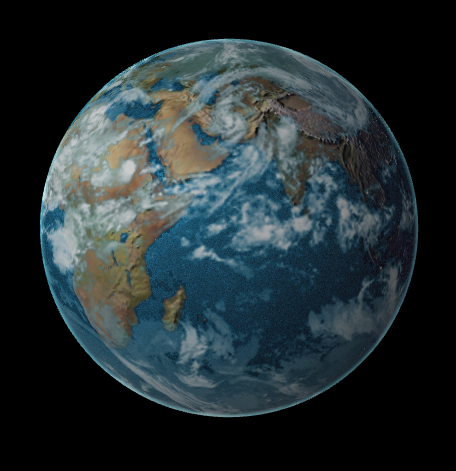
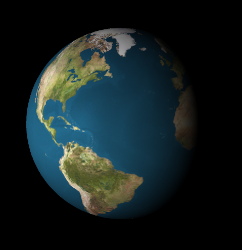
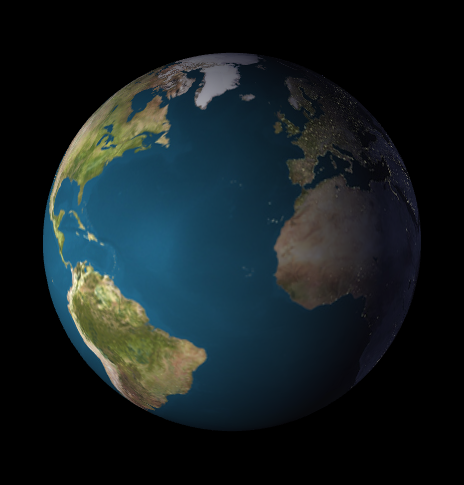
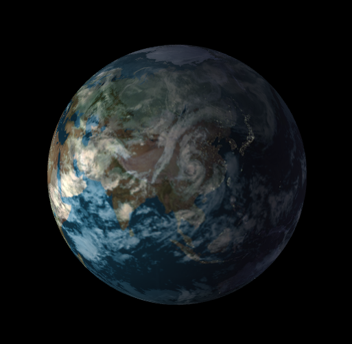
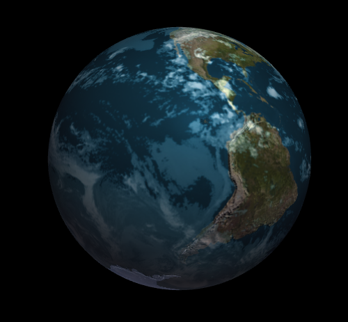
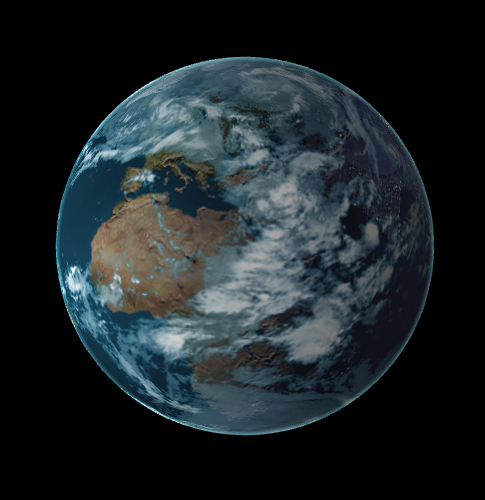
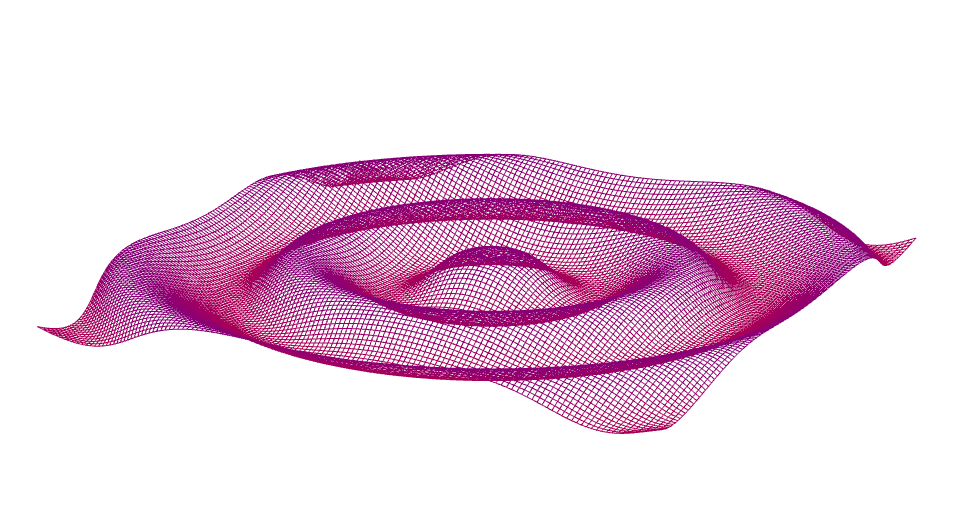

This project has a wave renderer and a globe renderer implemented using WebGL.
To run the demo, you need a WebGL capable browser like FireFox.

[Video here](https://www.youtube.com/watch?v=zg2oQxpIPbA&feature=youtu.be)

[Live demo](http://jianqiaol.github.io/Project5-WebGL/)

###Globe renderer Walk through
The original code generate this basic globe with Earth terrain color mapping looks like this:

* Night light

By taking the dot product of the light direction and normal direciton of each vertex, I generated a night_flag, from -1 to 1. negative means day time while positive means night time. Then using the mix function I got this:

* Add cloud

Using the cloud map and cloudTrans map, I mixed the terrian color with cloud. The coordinate of cloud is shifted by time to make it move.

* Add Bump mapping

By adjusting the normal for each vertex based on the height map, we can add bump mapping. 

* Add Rim lighting

If the normal direction of a fragment is orthrogonal or close to orthrogonal to camera direction, we add some blue-ish color to it.

* Add water simulation

By adding some noise to the water diffuse factor, we can make a shiny ocean surface. The random generator was found here: http://www.java-gaming.org/index.php?topic=28018.0

###Custome ripple

This ripple simulates a water drop. The main implementation is based on the distance from the center of drop to each vertex. The height is calculated by a sin function, with parameters such as wave speed,decay factor and so on. 

###Performance evaluation
Throughout the whole process, I didn't see any noticeable change after any feature is added. 

-------------------------------------------------------------------------------
THIRD PARTY CODE POLICY
-------------------------------------------------------------------------------
* The random generator I used for water simulation is from here:http://www.java-gaming.org/index.php?topic=28018.0
